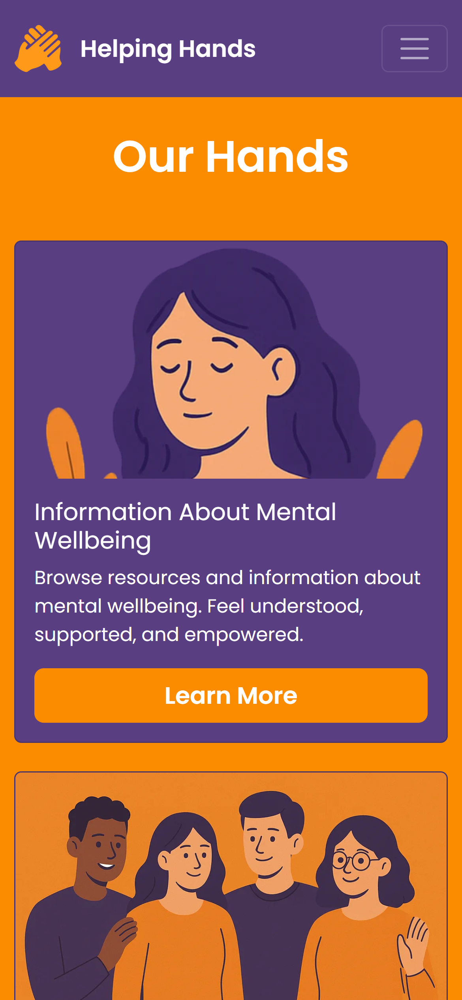
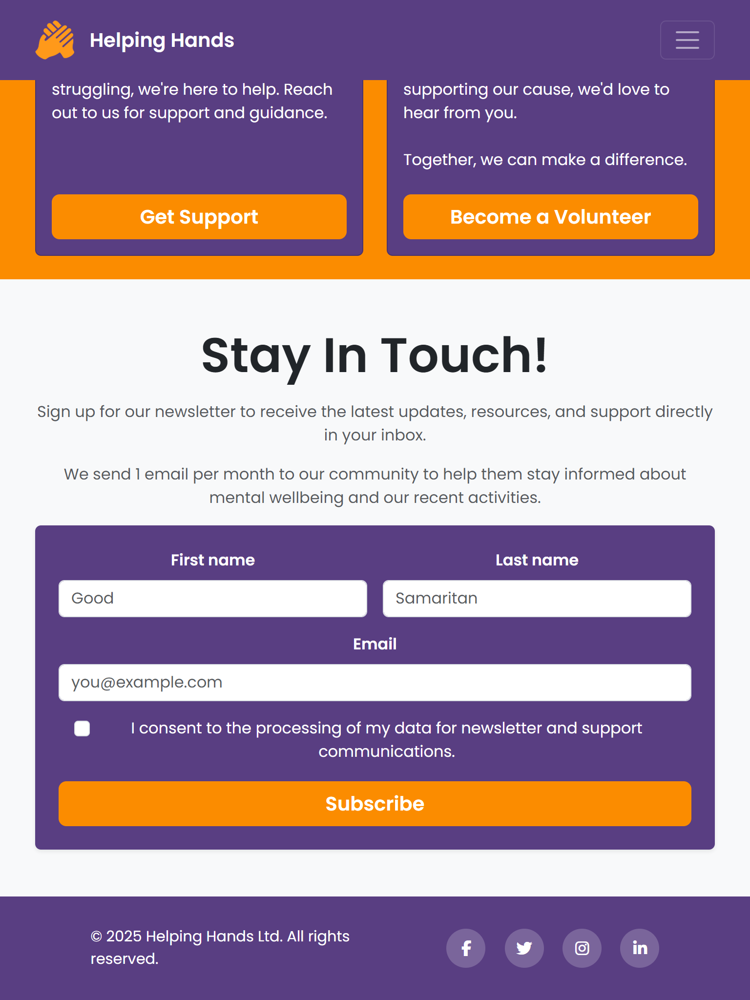
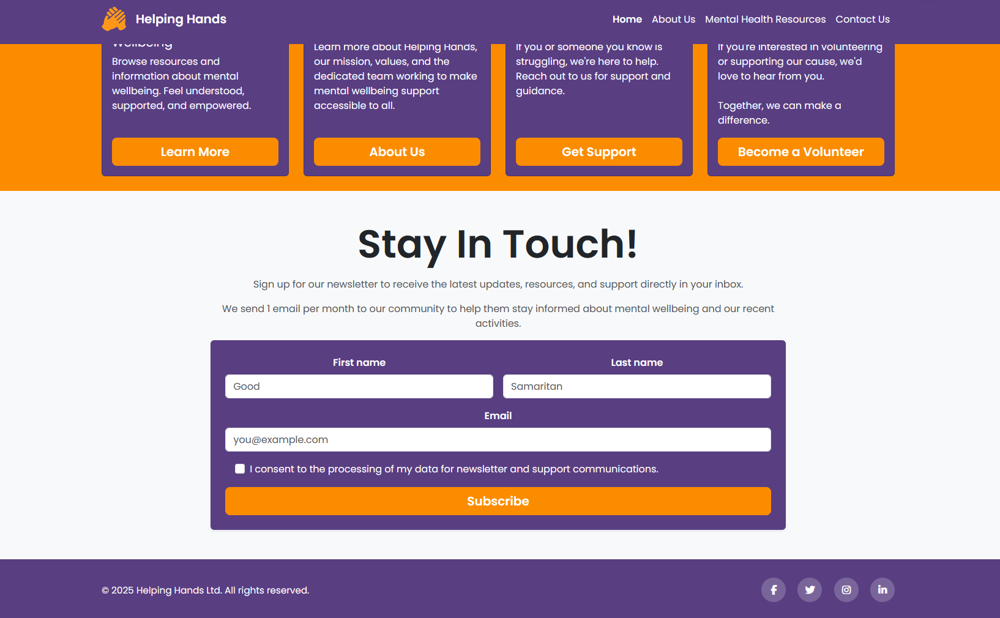

# Helping Hands

## Introduction

Helping Hands is a mental health awareness and support website designed to provide accessible, welcoming resources for individuals seeking information and help with their mental wellbeing. Visitors can explore common mental health topics, learn a bit about the team, and contact the team to request help or offer to volunteer.

### What It Is

A static, fully responsive website built with a focus on accessibility, clean design, and user-friendly navigation. The project emphasizes a calm, consistent visual identity with soothing color schemes and typography.

### Standout Features

-   **Bootstrap 5**: Utilizes the latest version of Bootstrap for a modern, responsive layout.
-   **Consistent Styling / Brand Identity**: Employs a calming color palette and typography to create a welcoming atmosphere.
-   **Responsive**: Optimized for all devices, ensuring usability on desktops, tablets, and smartphones.
-   **Framework / Component-ready**: Modular HTML structure with clear class names for easy updates and maintenance. Can easily be integrated into frameworks like React or Vue.

A live version of the site can be accessed [via my GitHub Pages](https://lewis1190.github.io/ci-helping-hands/).

## Site Screenshots

### Mobile Home Page (Simulated on an iPhone 12 Pro)

Mobile Screenshots (click to expand)

### iPad / Tablet Home Page (Simulated on an iPad Mini)

iPad / Tablet Screenshots (click to expand)

### Desktop Home Page

Desktop Screenshots (click to expand)

