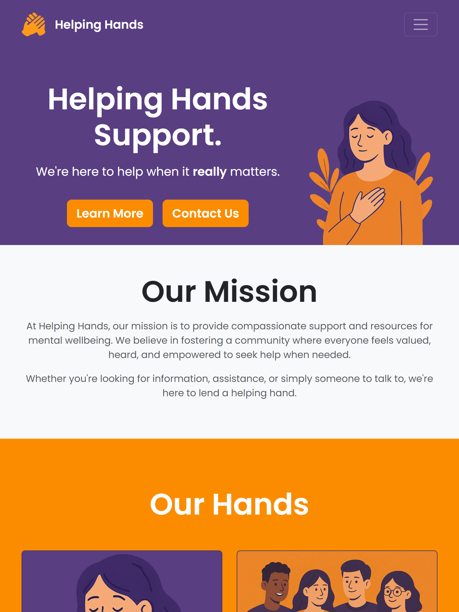
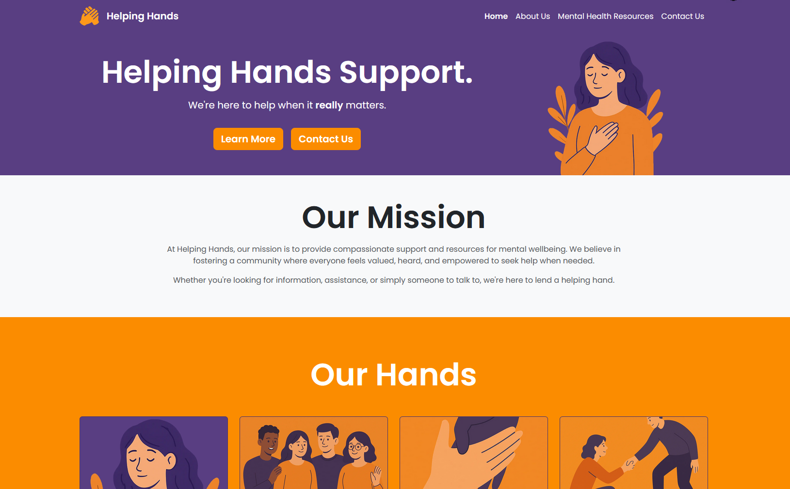

# Helping Hands

## Introduction

Helping Hands is a mental health awareness and support website designed to provide accessible, welcoming resources for individuals seeking information and help with their mental wellbeing. Visitors can explore common mental health topics, learn a bit about the team, and contact the team to request help or offer to volunteer.

### What It Is

A static, fully responsive website built with a focus on accessibility, clean design, and user-friendly navigation. The project emphasizes a calm, consistent visual identity with soothing color schemes and typography.

### Standout Features

-   **Bootstrap 5**: Utilizes the latest version of Bootstrap for a modern, responsive layout.
-   **Consistent Styling / Brand Identity**: Employs a calming color palette and typography to create a welcoming atmosphere.
-   **Responsive**: Optimized for all devices, ensuring usability on desktops, tablets, and smartphones.
-   **Framework / Component-ready**: Modular HTML structure with clear class names for easy updates and maintenance. Can easily be integrated into frameworks like React or Vue.

A live version of the site can be accessed [via my GitHub Pages](https://lewis1190.github.io/ci-helping-hands/).

## Site Screenshots

### Mobile Home Page (Simulated on an iPhone 12 Pro)

Mobile Screenshots (click to expand)

### iPad / Tablet Home Page (Simulated on an iPad Mini)

iPad / Tablet Screenshots (click to expand)

### Desktop Home Page

Desktop Screenshots (click to expand)

## UX / UI Design

### Fonts and Typography

-   [Fontawesome](https://fontawesome.com/) for icons to enhance visual appeal and usability. Used for the social media icons, and the tick in the page after a user submits any contact form.

-   [Google Fonts](https://fonts.google.com/) for the fonts; I used the font 'Poppins' for headings and body text. I chose a single font here, as that was my intended branding and design for the site to keep it as clean and accessible as possible.

### Color Palette

Purple and orange were my chosen primary colors for the site. I used [Colormind](http://colormind.io/) to help me pick the lighter shades for the colors, for accents and button highlights.

### Branding

I was passing ideas for branding and characters back and forth with ChatGPT to see what it would suggest. I wanted to use AI for my image generation, and wanted to use this opportunity to test how it could create a consistent brand with my color palette and theme.

Above is my initial prompt to ChatGPT that helped me decide on the brand for the site. I was really happy with the mockup it gave me, as it allowed me to visualize possible layouts before committing to a specific design.

I branched off from this prompt to get more specific images for the site, such as the mental health info card images and the service card images.

Below is an example of me using the branch prompt to create further content for the site. I would then edit these images in Photoshop to remove the background colors and crop them roughly to the aspect ratio I needed for the site, then tidy it up with CSS.

### Wireframes

This was my first time using Balsamiq. In previous roles that I've worked in, wireframing was usually left to the dedicated design teams, so I wanted to try my hand at it for this project.

I spent a lot of time on the wireframing stage, as I wanted to make sure I had a solid plan for the layout and structure of the site before I started coding it.

I also put together a basic sitemap for my initial idea for the site. As I'll discuss later, you can see in these designs how the final product differs slightly from the initial plan, and how some pages in the sitemap were merged or removed entirely due to time constraints.

**NOTE:** These images are quite large, so please right click and open them in a new tab if you're having trouble viewing them in full.

#### Sitemap

#### Home Page Wireframe

#### About Page Wireframe

#### Community and Testimonials Page Wireframe

#### Mental Health Information Page Wireframe

#### Contact Page Wireframe

#### Form Submitted Page Wireframe

