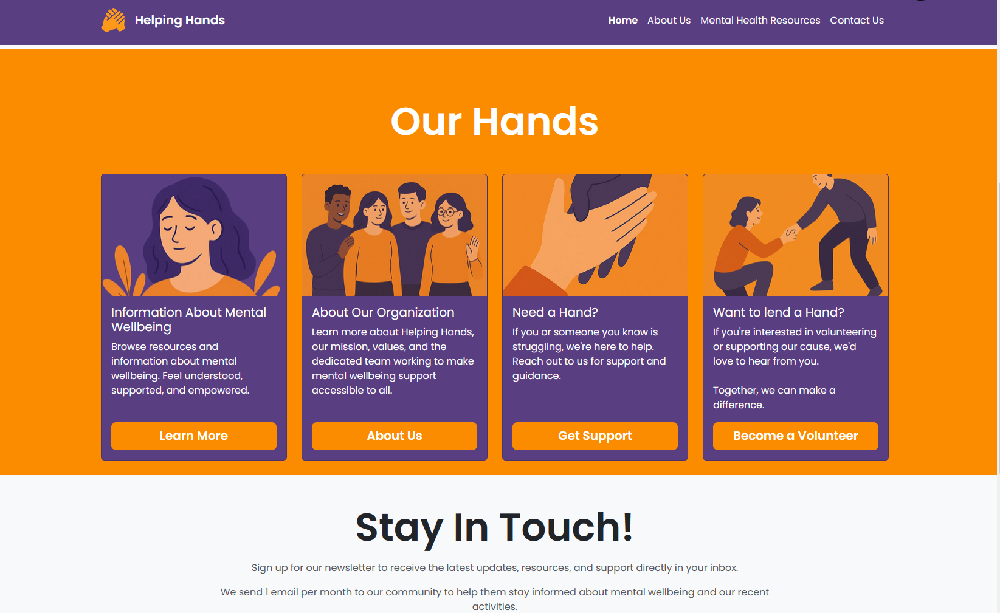
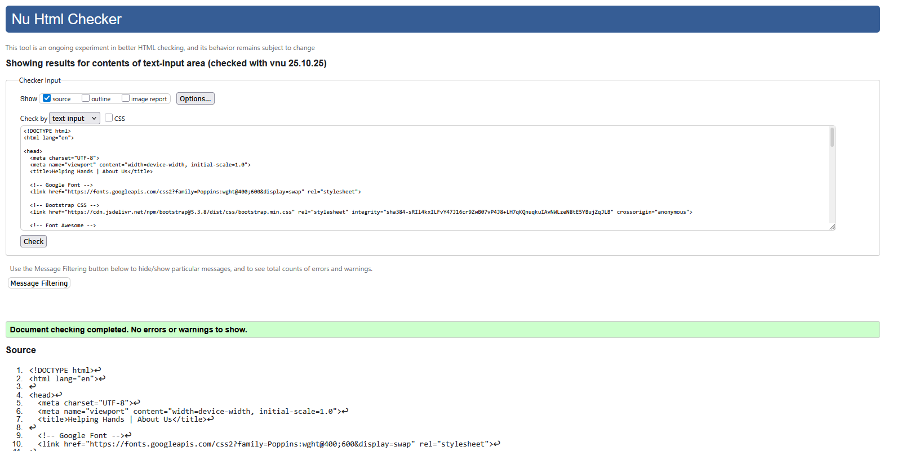
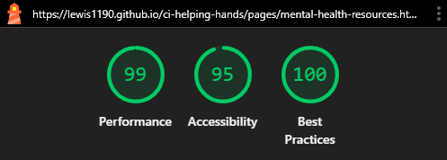

# Helping Hands

## Introduction

Helping Hands is a mental health awareness and support website designed to provide accessible, welcoming resources for individuals seeking information and help with their mental wellbeing. Visitors can explore common mental health topics, learn a bit about the team, and contact the team to request help or offer to volunteer.

### What It Is

A static, fully responsive website built with a focus on accessibility, clean design, and user-friendly navigation.

Page-by-page, the site includes:

-   **Home Page**: Nice banner image, immediate reveal of the illustrated character that will be used across the site. A brief strapline about the purpose of Helping Hands, followed by a set of cards summarizing to users the type of content available on the site. The user will be signposted to other features either from here or the navigation bar.
-   **About Page**: Information about the mission and values of Helping Hands, along with profiles of the team members involved in running the site and providing support.
-   **Mental Health Resources**: A dedicated section with information cards on common mental health topics and problems. The site explains what each diagnosis is, how to spot the signs, and mindful tips for coping. Each card section ends with a positive affirmation to uplift the user.
-   **Contact Page**: A simple contact form allowing users to reach out for help or volunteer their time. The form includes fields for name, email, subject, drop-down for the topic of the message, and finally a textarea. All fields have basic validation to ensure all required information is provided.
-   **Form Submitted Page**: A very simple page to confirm to the user that their form has been successfully submitted, and a button to signpost them back to the home page.

### Standout Features

-   **Bootstrap 5**: Utilizes the latest version of Bootstrap for a modern, responsive layout.
-   **Consistent Styling / Brand Identity**: Employs a calming color palette and typography to create a welcoming atmosphere.
-   **Responsive**: Optimized for all devices, ensuring usability on desktops, tablets, and smartphones.
-   **Framework / Component-ready**: Modular HTML structure with clear class names for easy updates and maintenance. Can easily be integrated into frameworks like React or Vue.
-   **Aggressive Optimization of Assets**: The Lighthouse audit tool from Chrome DevTools highlighted to me that my images were unnecessarily large in size, which was impacting the performance score of my site. I used [Cloudinary](https://cloudinary.com/tools/png-to-webp) to compress my images and convert them from `.png` format to `.webp` format, which reduced my total image asset size by **_~90%_**!

### "The AI Bit"; how I used AI in this project

The use of generative AI played a key role in the development of this project. AI allowed me to stay efficient and keep working to deliver maximum output on the short deadline that this assignment had:

-   **Image Generation**: I used ChatGPT to generate the illustrated characters that I used across the whole site. ChatGPT was smart enough to ensure that each image adhered to my specified color palette, as well as keeping the design and appearance of the characters consistent across the different images. I would then edit these images in Photoshop to remove the background colors and crop them roughly to the aspect ratio I needed.
-   **Text Content Creation**: I used ChatGPT to help me draft the content for the mental health information cards. The Copilot feature in VS Code was particularly useful here, as it could monitor what my project was about, and suggest text content as I scaffold the HTML.
-   **Layout and Scaffolding**: When dealing with complex layouts (e.g. the mental health info panels), I asked Copilot to generate me the rough grid structure in HTML and Bootstrap classes. These often has small styling issues, so a full understanding of Bootstrap and HTML was required from me in order to tweak the styles to exactly how I wanted them.

### Copyright / DMCA Compliance

-   **Images**: For the headshots of the team members in the "About Us" page, I used [Unsplash](https://unsplash.com/) to find royalty-free images of professional headshots. For the illustrated character and other images on the site, I used ChatGPT to generate these assets. Whilst I'm confident that the Unsplash images are compliant with copyright law, any content generated by AI remains in a grey area as of the time of writing.

### Leftovers / Cut Features / Other TODOs

-   **Color Palette Accessibility**: According to WCAG guidelines, my white text on orange backgrounds does not meet the required contrast ratio for accessibility. However, I was unable to adjust the colors further without ruining the overall design and feel of the site. In the future, I would like to add a "high-contrast" toggle button to the site that would switch to a more accessible color palette for users that need it, while still maintaining the original design for other users.
-   **"Form Received" Page Footer**: This page doesn't have enough content to pad the footer to the bottom of the viewport on larger screens. I tried all manner of Bootstrap classes and `margin: auto`'s, but I couldn't get it to work as intended. As this screen is rarely viewed, and not viewed for long, I've stuck a `TODO` comment above the footer in this file to come back to another time.
-   **Cut Pages**: Due to time constraints, I was unable to implement the Community and Testimonials page that I had originally planned. I also merged the Mental Health Information and Resources pages into a single page to save time. In the future, I would like to expand these sections into their own dedicated pages with more content and features, as well as signpost users to external resources on the NHS website.
    -   You can see the original and final sitemaps in the Wireframes section below.

A live version of the site can be accessed [via my GitHub Pages](https://lewis1190.github.io/ci-helping-hands/).

## Site Screenshots

### Mobile Home Page (Simulated on an iPhone 12 Pro)

Mobile Screenshots (click to expand)

### iPad / Tablet Home Page (Simulated on an iPad Mini)

iPad / Tablet Screenshots (click to expand)

### Desktop Home Page

Desktop Screenshots (click to expand)

## UX / UI Design

### Fonts and Typography

-   [Fontawesome](https://fontawesome.com/) for icons to enhance visual appeal and usability. Used for the social media icons, and the tick in the page after a user submits any contact form.

-   [Google Fonts](https://fonts.google.com/) for the fonts; I used the font 'Poppins' for headings and body text. I chose a single font here, as that was my intended branding and design for the site to keep it as clean and accessible as possible.

### Color Palette

Purple and orange were my chosen primary colors for the site. I used [Colormind](http://colormind.io/) to help me pick the lighter shades for the colors, for accents and button highlights.

### Branding

I was passing ideas for branding and characters back and forth with ChatGPT to see what it would suggest. I wanted to use AI for my image generation, and wanted to use this opportunity to test how it could create a consistent brand with my color palette and theme.

Above is my initial prompt to ChatGPT that helped me decide on the brand for the site. I was really happy with the mockup it gave me, as it allowed me to visualize possible layouts before committing to a specific design.

I branched off from this prompt to get more specific images for the site, such as the mental health info card images and the service card images.

Below is an example of me using the branch prompt to create further content for the site. I would then edit these images in Photoshop to remove the background colors and crop them roughly to the aspect ratio I needed for the site, then tidy it up with CSS.

### Wireframes

This was my first time using Balsamiq. In previous roles that I've worked in, wireframing was usually left to the dedicated design teams, so I wanted to try my hand at it for this project.

I spent a lot of time on the wireframing stage, as I wanted to make sure I had a solid plan for the layout and structure of the site before I started coding it.

I also put together a basic sitemap for my initial idea for the site. As I'll discuss later, you can see in these designs how the final product differs slightly from the initial plan, and how some pages in the sitemap were merged or removed entirely due to time constraints.

**NOTE:** These images are quite large, so please right click and open them in a new tab if you're having trouble viewing them in full.

#### Sitemap

#### Home Page Wireframe

#### About Page Wireframe

#### Community and Testimonials Page Wireframe

#### Mental Health Information Page Wireframe

#### Contact Page Wireframe

#### Form Submitted Page Wireframe

## User Stories

Below are the user stories I used to guide my development of the site. I briefed ChatGPT with the example brief in the LMS, and requested 10 user stories based on that brief. It also generated the acceptance criteria, and the tasks required.

Below are the top-level user stories only. The full list with acceptance criteria and tasks can be found in the [Github project](https://github.com/users/lewis1190/projects/4/views/1) that I ran for this repo.

-   As a **_visitor_**, I want a calming hero section with an encouraging headline and background image so I feel welcomed immediately.
-   As the **_site owner_**, I want to publish the static site to GitHub Pages so it is accessible online.
-   As a **_user_**, I want a set of information cards that clearly present common mental health topics so I can scan and learn quickly.
-   As a **_mobile user_**, I want the site to be fully responsive so content is usable on phones and tablets.
-   As a **_visitor_**, I want a Positive Affirmations section with short uplifting messages so I can leave the site feeling encouraged.
-   As a **_visitor seeking help_**, I want a resource links grid with clear calls-to-action so I can access external support easily.
-   As the **_site owner_**, I want a calm, consistent color scheme and typography so the site feels welcoming and cohesive.
-   As a **_user with visual impairments_**, I want the site to follow basic accessibility best practices so I can navigate and read content easily.
-   As a **_content editor_**, I want modular HTML sections and clear class names so I can update content without breaking layout.
-   As the **_site owner_**, I want basic SEO and metadata so the site is discoverable and shares well on social platforms.

## Testing and Validation

Here are the tools I used to verify and validate my code during development:

-   **[HTML Validator](https://validator.w3.org/)**: I used the W3C Markup Validation Service to check my HTML for any syntax errors or issues.
-   **[CSS Validator](https://jigsaw.w3.org/css-validator/)**: The W3C CSS Validation Service helped me ensure my stylesheets were error-free and followed best practices.
-   **[Autoprefixer for CSS](https://autoprefixer.github.io/)**: I used Autoprefixer to automatically add vendor prefixes to my CSS rules, ensuring better compatibility with different browsers such as Opera and Safari.
-   **[Lighthouse for Chrome DevTools](https://developers.google.com/web/tools/lighthouse)**: I used Lighthouse to audit my site for performance, accessibility, and SEO best practices. This was a great way to score my site and identify actionable steps I can take to increase the quality of my site.
-   **Physical Device Testing**: I tested the site on multiple physical devices, including an iPhone SE, a 2025 iPad, and a Windows 10 desktop and a OnePlus 6T to ensure consistent performance and appearance across different screen sizes and operating systems.

Below are a collection of screenshots of me using all of the above tools.

### HTML Validator

W3C Validator Screenshots (click to expand)

### CSS Validator

CSS Validator Screenshot (click to expand)

### AutoPrefixer Usage

AutoPrefixer Usage Screenshot (click to expand)

### Lighthouse Audits

Lighthouse Audits Screenshots (click to expand)

